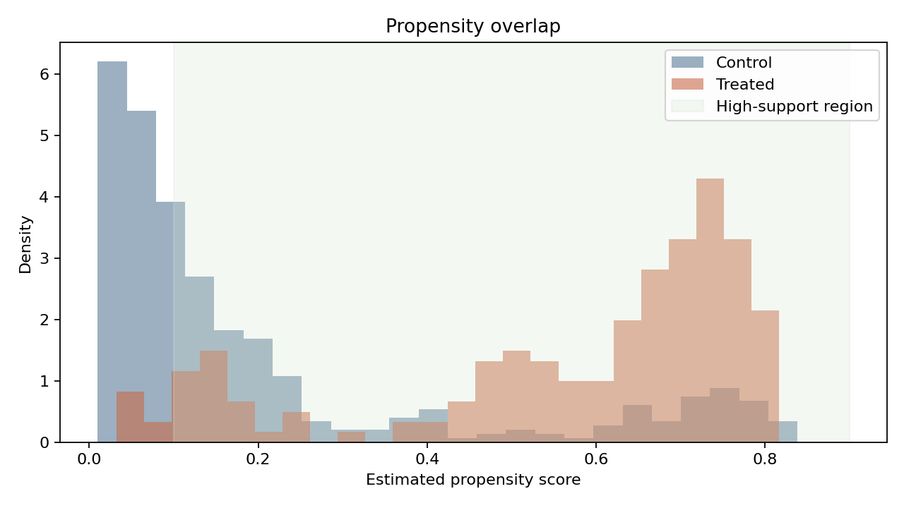
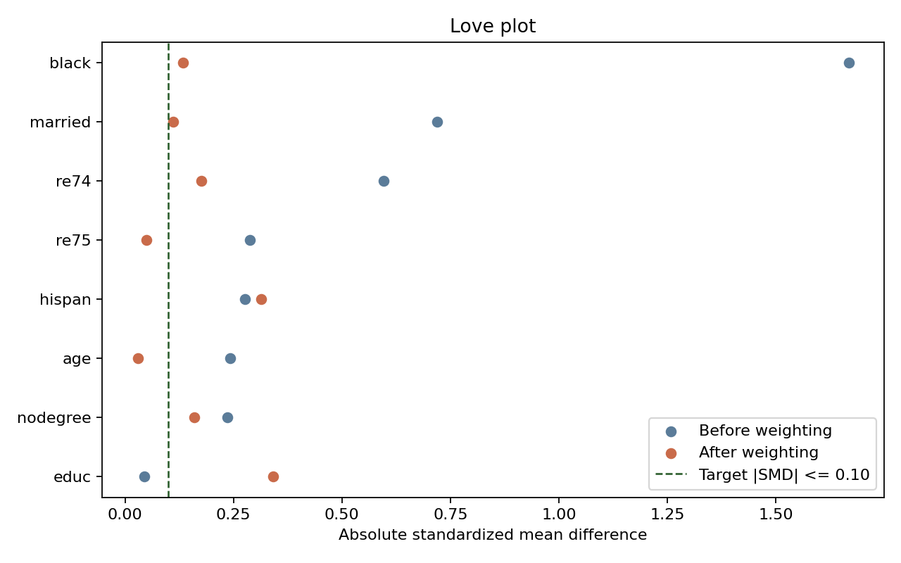
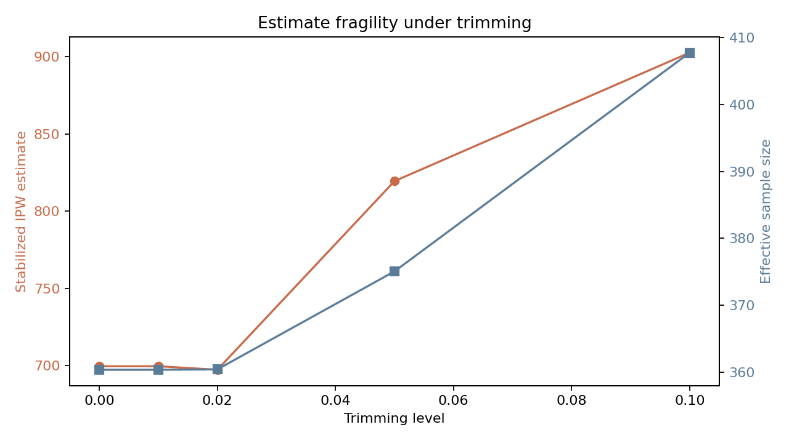
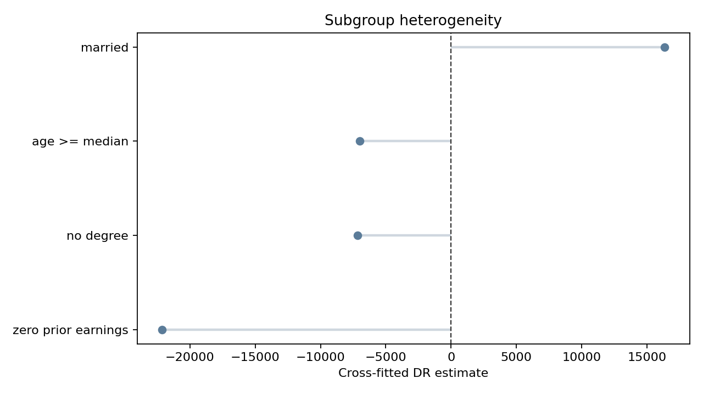

# Causal Estimates on LaLonde Job Training Data

## Study Design
- Dataset: LaLonde observational benchmark (N=614).
- Target estimand focus: ATE, with ATT-style matching reported as a triangulation check rather than the sole answer.
- Identification strategy: conditional ignorability given observed pre-treatment covariates, then stress-tested with overlap, balance, weight, and placebo checks.

## Model Selection for the Propensity Step
| Specification | Max |SMD| After SIPW | Mean |SMD| After SIPW | Brier | Log Loss |
|---|---:|---:|---:|---:|
| linear logistic | 0.341 | 0.164 | 0.1360 | 0.4220 |
| nonlinear logistic | 0.417 | 0.207 | 0.1575 | 0.4686 |
- Selected specification: `linear logistic` because it produced the best post-weight balance, not just the best fit metric.

## Effect Estimates
| Estimator | Estimate | 95% CI |
|---|---:|---:|
| Naive difference | -635.03 | [-1,144.87, 369.02] |
| Matching ATT (no caliper) | 1,890.08 | n/a |
| Matching ATT (0.2 SD caliper) | 1,890.08 | n/a |
| Raw IPW ATE | -622.23 | n/a |
| Stabilized IPW ATE | 699.56 | [-958.49, 2,887.91] |
| Overlap-weighted ATE | 1,716.30 | n/a |
| Doubly robust ATE | -400.32 | n/a |
| Cross-fitted DR ATE | 434.86 | [-1,987.33, 2,889.26] |

## Propensity and Weight Diagnostics
- Treated score p01-p99: 0.055 to 0.808
- Control score p01-p99: 0.011 to 0.805
- Share of extreme propensity scores (<0.05 or >0.95): 17.427%
- Stabilized IPW weights: mean=1.001, median=0.755, p95=2.835, max=9.233, ESS=360.3
- Overlap weights: mean=0.270, median=0.192, p95=0.810, max=0.967, ESS=330.4
- High-support share (0.10 <= ps <= 0.90): 65.3%
- Cross-fitted DR estimate restricted to high-support region: 1,425.71

## Balance Diagnostics
- Max absolute post-weight |SMD| after stabilized IPW: 0.341
- Mean absolute post-weight |SMD| after stabilized IPW: 0.164

| Covariate | SMD Before | SMD After SIPW | SMD After Overlap Weights |
|---|---:|---:|---:|
| age | -0.242 | -0.029 | 0.232 |
| black | 1.668 | 0.133 | 0.129 |
| educ | 0.045 | 0.341 | 0.344 |
| hispan | -0.277 | 0.313 | 0.192 |
| married | -0.719 | -0.111 | 0.050 |
| nodegree | 0.235 | -0.159 | -0.114 |
| re74 | -0.596 | -0.176 | 0.040 |
| re75 | -0.287 | -0.049 | 0.043 |

### Highest Residual Imbalance After Stabilized IPW
| Covariate | Absolute SMD After |
|---|---:|
| educ | 0.341 |
| hispan | 0.313 |
| re74 | 0.176 |

## Placebo / Falsification Checks
| Pseudo-outcome | Cross-fitted DR estimate |
|---|---:|
| re74 | -0.00 |
| re75 | -0.00 |

## Heterogeneity Checks
| Subgroup | N | Cross-fitted DR estimate |
|---|---:|---:|
| age >= median | 314 | -6,976.40 |
| no degree | 387 | -7,151.26 |
| zero prior earnings | 176 | -22,118.64 |
| married | 255 | 16,365.12 |

## Trimming Sensitivity
| Trim Level | Stabilized IPW ATE | Effective Sample Size | Max Weight |
|---:|---:|---:|---:|
| 0.00 | 699.56 | 360.3 | 9.23 |
| 0.01 | 699.56 | 360.3 | 9.23 |
| 0.02 | 697.26 | 360.4 | 9.23 |
| 0.05 | 819.50 | 375.1 | 6.03 |
| 0.10 | 902.76 | 407.8 | 4.33 |

## Figures

## What Changed My Mind
- The first-pass estimate alone is not the interesting part here; the interesting part is how much the answer moves once overlap and weight stability are taken seriously.
- The placebo outcomes and residual imbalance keep this from becoming a fake-certainty project. They make the limitations visible instead of burying them.
- If I had to act on this analysis, I would trust the high-support, diagnostics-clean slices far more than a single full-sample point estimate.
